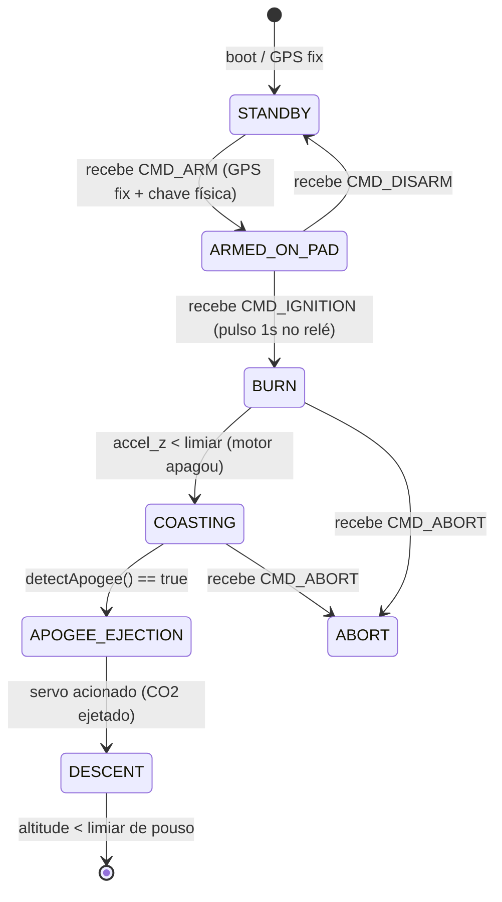
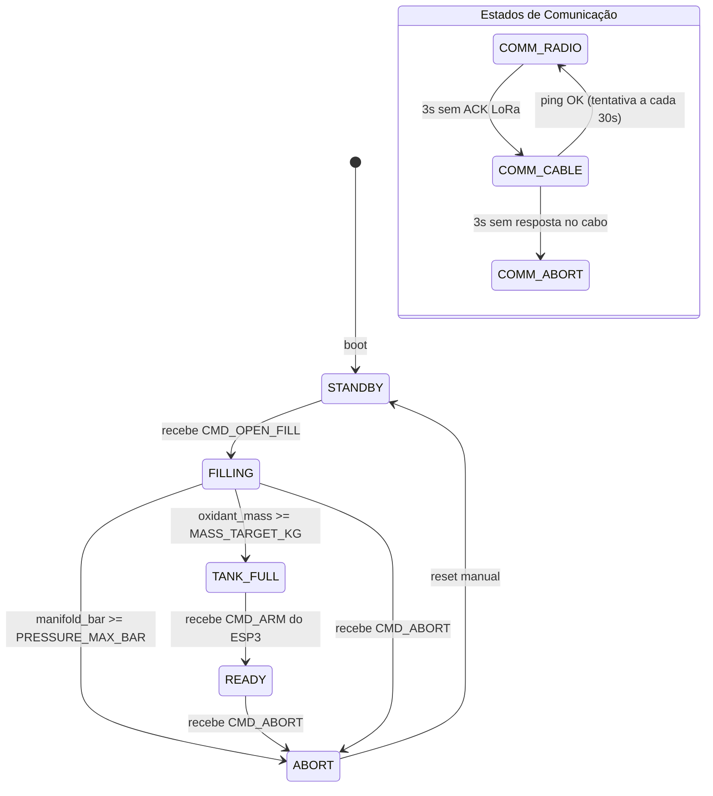
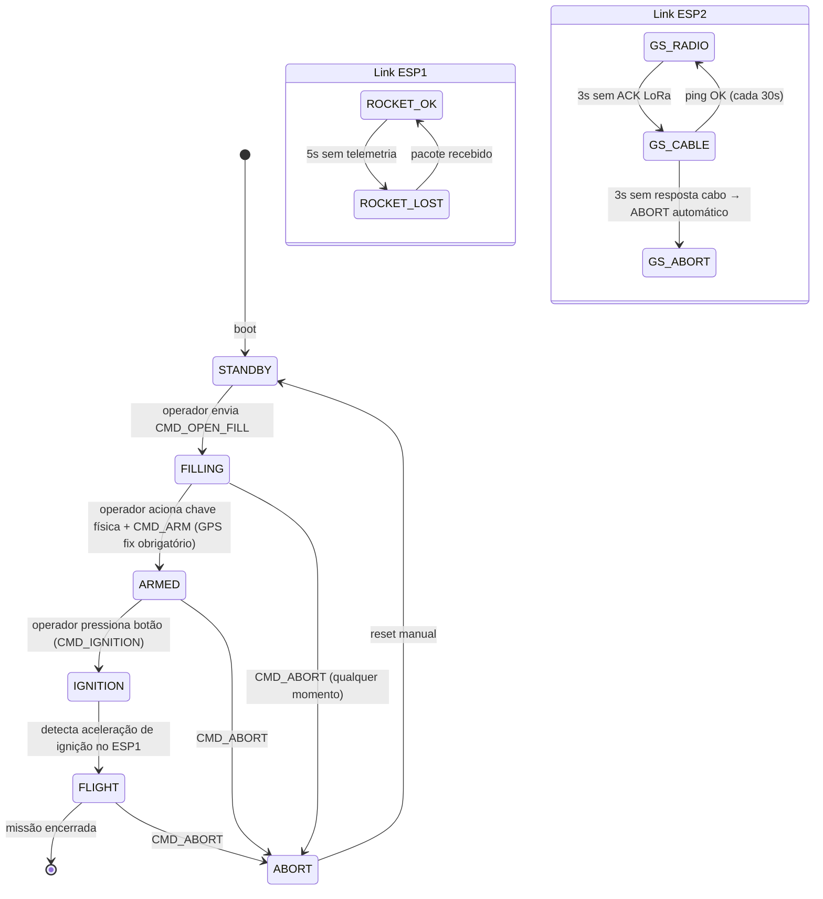

# Guia Técnico — Capital Rocket Team Software 2026

> **Este é um documento vivo.** Toda mudança de hardware, protocolo ou decisão de software deve ser refletida aqui imediatamente. Atualize sempre via branch `dev/shared-config`.

---

## Índice

1. [Visão Geral do Sistema](#1-visão-geral-do-sistema)
2. [Configuração do Ambiente](#2-configuração-do-ambiente)
3. [Mapeamento de Pinos](#3-mapeamento-de-pinos)
4. [Protocolo de Comunicação LoRa](#4-protocolo-de-comunicação-lora)
5. [Redundância por Cabo (Serial2)](#5-redundância-por-cabo-serial2)
6. [State Machines Completas](#6-state-machines-completas)
7. [Parâmetros Críticos](#7-parâmetros-críticos)
8. [Detecção de Apogeu](#8-detecção-de-apogeu)
9. [Telemetria CSV](#9-telemetria-csv)
10. [Ambiente de Testes](#10-ambiente-de-testes)
11. [Dados dos Sensores](#11-dados-dos-sensores)
12. [Regras de Contribuição](#12-regras-de-contribuição)

---

## 1. Visão Geral do Sistema

O sistema é composto por **3 nós ESP32-WROOM** que se comunicam via rádio LoRa (SX1278 @ 433 MHz) usando a biblioteca RadioHead (`RHReliableDatagram`).

### Responsabilidades por nó

| Nó | Apelido | Responsabilidade |
|---|---|---|
| **ESP1** | Foguete | Ler sensores de voo (IMU, barômetro, GPS), detectar apogeu, acionar servo, enviar telemetria para ESP3 |
| **ESP2** | Ground Station | Controlar válvulas via relés, ler massa (HX711) e pressão do manifold, receber comandos do ESP3, enviar telemetria |
| **ESP3** | Central / Maleta | Interface do operador, receber telemetria dos dois nós, enviar comandos para ESP2, monitorar watchdogs, gerar CSV de missão |

### Fluxo de dados

```
ESP1 ──[PKT_TELEMETRY_ROCKET]──► ESP3
ESP2 ──[PKT_TELEMETRY_GS]──────► ESP3
ESP3 ──[PKT_COMMAND]───────────► ESP2
ESP3 ──[PKT_PING]──────────────► ESP1 / ESP2   (heartbeat)
```

---

## 2. Configuração do Ambiente

### Opção A — Arduino IDE *(recomendada para iniciantes)*

1. **Baixe o Arduino IDE 2.x** em: https://www.arduino.cc/en/software

2. **Adicione o suporte ao ESP32:**
   - Vá em *File → Preferences → Additional Board Manager URLs* e cole:
     ```
     https://raw.githubusercontent.com/espressif/arduino-esp32/gh-pages/package_esp32_index.json
     ```
   - Vá em *Tools → Board → Board Manager*, busque `esp32` e instale **esp32 by Espressif Systems**

3. **Selecione a placa:**
   - *Tools → Board → esp32 → **ESP32 Dev Module***

4. **Instale as bibliotecas:**
   - *Tools → Manage Libraries* e instale uma a uma:
     - `RadioHead` (by Mike McCauley)
     - `TinyGPSPlus` (by Mikal Hart)
     - `Adafruit BMP280 Library` (by Adafruit)
     - `Adafruit Unified Sensor` (by Adafruit — dependência do BMP280)
     - `MPU6050` (by Electronic Cats)
     - `HX711` (by Bogdan Necula)

5. **Drivers USB:**
   - Chip **CP2102** → instale [CP210x de Silicon Labs](https://www.silabs.com/developers/usb-to-uart-bridge-vcp-drivers)
   - Chip **CH340** → instale [CH340 driver](https://sparks.gogo.co.nz/ch340.html)
   - Para descobrir o chip: olhe o chip menor ao lado da porta USB da placa

6. **Abra um subsistema:**
   - *File → Open* e navegue até a pasta `Foguete_ESP1/Foguete_ESP1/Foguete_ESP1.ino` (ou o que for trabalhar)

> ⚠️ **Atenção:** O Arduino IDE exige que o arquivo `.ino` esteja dentro de uma pasta de **mesmo nome**. Por isso temos a estrutura de pasta dupla (`Foguete_ESP1/Foguete_ESP1/`). Não mova nem renomeie as pastas.

---

### Opção B — VSCode + PlatformIO *(recomendada para quem já usa VSCode)*

1. **Instale o VSCode:** https://code.visualstudio.com

2. **Instale a extensão PlatformIO IDE:**
   - Abra a aba de extensões (`Ctrl+Shift+X`)
   - Busque `PlatformIO IDE` e clique em *Install*
   - Aguarde o download completo e reinicie o VSCode

3. **Abra o projeto:**
   - Clique no ícone do PlatformIO na barra lateral → *Open Project* → navegue até a pasta do subsistema (ex: `Foguete_ESP1/`)

4. **Configure o `platformio.ini`** na raiz de cada subsistema:
   ```ini
   [env:esp32dev]
   platform = espressif32
   board = esp32dev
   framework = arduino
   lib_deps =
       mikem/RadioHead
       mikalhart/TinyGPSPlus
       adafruit/Adafruit BMP280 Library
       adafruit/Adafruit Unified Sensor
       electroniccats/MPU6050
       bogde/HX711
   ```
   O PlatformIO baixa as bibliotecas automaticamente no primeiro build.

5. **Drivers USB:** os mesmos da Opção A (CP210x ou CH340).

6. **Vantagens do PlatformIO:**
   - Autocomplete completo com os tipos do ESP32
   - Compilação mais rápida
   - Múltiplas versões de bibliotecas sem conflito entre projetos

---

## 3. Mapeamento de Pinos

> Todos os pinos estão centralizados em [`Shared_Config/config.h`](./Shared_Config/config.h). **Nunca defina pinos fora desse arquivo.**

### Pinos LoRa SPI — iguais nos 3 ESPs

| Define | GPIO | Função |
|---|---|---|
| `PIN_LORA_SCK` | 18 | SPI Clock |
| `PIN_LORA_MISO` | 19 | SPI MISO |
| `PIN_LORA_MOSI` | 23 | SPI MOSI |
| `PIN_LORA_CS` | 5 | Chip Select |
| `PIN_LORA_RST` | 14 | Reset do módulo |
| `PIN_LORA_DIO0` | 2 | Interrupção (RX done / TX done) |

### Pinos I2C — iguais nos 3 ESPs

| Define | GPIO | Dispositivos |
|---|---|---|
| `PIN_I2C_SDA` | 21 | MPU-6050, BMP280 |
| `PIN_I2C_SCL` | 22 | MPU-6050, BMP280 |

### ESP1 — Foguete (Computador de Bordo)

| Define | GPIO | Função |
|---|---|---|
| `PIN_GPS_RX` | 25 | Serial1 RX ← GPS TX |
| `PIN_GPS_TX` | 26 | Serial1 TX → GPS RX |
| `PIN_SERVO` | 13 | Servo motor (apogeu) |
| + todos os LoRa e I2C | — | Ver tabelas acima |

> ⚠️ **Conflito Serial2/GPS resolvido:** O cabo de redundância usa **Serial2** (GPIO 16/17). O GPS usa **Serial1 remapeado** para GPIO **25/26** — pinos livres, sem conflito. O remapeamento é feito diretamente no `begin()`:
> ```cpp
> Serial1.begin(9600, SERIAL_8N1, PIN_GPS_RX, PIN_GPS_TX);   // GPS
> ```

### ESP2 — Ground Station

| Define | GPIO | Função |
|---|---|---|
| `PIN_CABLE_RX` | 16 | Serial2 RX ← ESP3 TX |
| `PIN_CABLE_TX` | 17 | Serial2 TX → ESP3 RX |
| `PIN_RELE_PURGA_NA` | 27 | Relé Purga NA (normalmente aberta) |
| `PIN_RELE_VENT` | 32 | Relé Vent |
| `PIN_RELE_PURGA_NF` | 33 | Relé Purga NF |
| `PIN_RELE_VALVULA_FILL` | 25 | Relé Válvula de Enchimento |
| `PIN_HX711_DOUT` | 13 | HX711 data |
| `PIN_HX711_SCK` | 12 | HX711 clock |
| `PIN_ACS712` | 34 | Sensor de corrente (ADC) |

### ESP3 — Central de Controle

| Define | GPIO | Função |
|---|---|---|
| `PIN_CABLE_RX` | 16 | Serial2 RX ← ESP2 TX |
| `PIN_CABLE_TX` | 17 | Serial2 TX → ESP2 RX |
| `PIN_CHAVE_ARM` | 27 | Chave física de armar |
| `PIN_BTN_IGNITION` | 32 | Botão de ignição |
| `PIN_BTN_ABORT` | 33 | Botão de aborto manual |

### Pinos proibidos

| GPIOs | Motivo |
|---|---|
| 6, 7, 8, 9, 10, 11 | Flash interno — **sistema trava** |
| 34, 35, 36, 39 | Input-only — não podem acionar relés ou servos |
| 0, 2, 4, 5, 12, 15 | Strapping — podem causar **falha de boot** |

---

## 4. Protocolo de Comunicação LoRa

### Biblioteca RadioHead

Usamos a classe `RHReliableDatagram` sobre o driver `RH_RF95` (compatível com o SX1278/RA-02).

**O RadioHead já fornece:**
- Endereçamento por nó (1 byte de ID)
- Retransmissão automática com ACK
- Timeout configurável

**Nós:**

| Nó | Endereço |
|---|---|
| ESP3 — Central | `NODE_ESP3_CENTRAL = 0x01` |
| ESP2 — Ground Station | `NODE_ESP2_GS = 0x02` |
| ESP1 — Foguete | `NODE_ESP1_ROCKET = 0x03` |

### Configuração LoRa (todos os ESPs devem ser idênticos)

```cpp
#include <RH_RF95.h>
#include <RHReliableDatagram.h>
#include "../../Shared_Config/config.h"

RH_RF95 rf95(PIN_LORA_CS, PIN_LORA_DIO0);
RHReliableDatagram manager(rf95, NODE_ESP3_CENTRAL); // alterar para o ID do seu nó

void setup() {
  manager.init();
  rf95.setFrequency(LORA_FREQUENCY / 1e6);       // 433.0 MHz
  rf95.setSpreadingFactor(LORA_SPREADING_FACTOR); // SF7
  rf95.setSignalBandwidth(LORA_BANDWIDTH);        // 125 kHz
  rf95.setCodingRate4(LORA_CODING_RATE);          // 4/5
  rf95.setTxPower(LORA_TX_POWER, false);          // 17 dBm
  manager.setRetries(RH_MAX_RETRIES);             // 3 tentativas
  manager.setTimeout(RH_TIMEOUT_MS);              // 200 ms por tentativa
}
```

### Enviar um pacote (ESP3 → ESP2)

```cpp
#include "../../Shared_Config/packet_protocol.h"

CommandPacket pkt;
pkt.packet_type = PKT_COMMAND;
pkt.command_id  = CMD_OPEN_FILL;
pkt.crc8        = calcCRC8((uint8_t*)&pkt, sizeof(pkt) - 1);

bool ok = manager.sendtoWait(
  (uint8_t*)&pkt, sizeof(pkt),
  NODE_ESP2_GS          // endereço destino
);

if (!ok) {
  // sem ACK após RH_MAX_RETRIES tentativas → tratar como falha de link
}
```

### Receber um pacote (qualquer nó)

```cpp
uint8_t buf[RH_RF95_MAX_MESSAGE_LEN];
uint8_t len = sizeof(buf);
uint8_t from;

if (manager.recvfromAck(buf, &len, &from)) {
  uint8_t pktType = buf[0]; // primeiro byte é sempre PacketType

  // Verificar CRC
  if (calcCRC8(buf, len - 1) != buf[len - 1]) {
    // pacote corrompido — descartar
    return;
  }

  if (pktType == PKT_TELEMETRY_ROCKET && from == NODE_ESP1_ROCKET) {
    RocketTelemetryPacket* data = (RocketTelemetryPacket*)buf;
    // usar data->altitude_m, data->accel_z, etc.
  }
}
```

> **Nota:** `recvfromAck()` é não-bloqueante — retorna `false` imediatamente se não houver pacote. Use-o no `loop()` sem `delay()`.

---

## 5. Redundância por Cabo (Serial2)

### Topologia

```
ESP3 GPIO17 (TX) ──────► ESP2 GPIO16 (RX)
ESP3 GPIO16 (RX) ◄────── ESP2 GPIO17 (TX)
```

> Conexão **cruzada**: TX de um lado vai para RX do outro. Além do par de dados, conecte também o **GND** entre as duas placas.

### Estados de comunicação ESP3 ↔ ESP2

```
COMM_RADIO  ──(3s sem ACK LoRa)──► COMM_CABLE
COMM_CABLE  ──(retry a cada 30s)──► tenta COMM_RADIO
COMM_CABLE  ──(3s sem resposta no cabo)──► COMM_ABORT (aborto automático)
COMM_ABORT  ──(não há retorno automático; exige reset manual)
```

O **ESP3 anuncia** a transição de estado no CSV e via Serial USB. O **ESP2** reporta seu `comm_state` atual na telemetria.

### Inicialização do cabo

```cpp
// ESP2 e ESP3 — adicionar no setup():
Serial2.begin(CABLE_BAUD_RATE, SERIAL_8N1, PIN_CABLE_RX, PIN_CABLE_TX);
```

### Enviar e receber pelo cabo

O cabo usa o **mesmo formato de pacote binário** do LoRa (`CommandPacket`, `GSTelemetryPacket`, etc.). O código de envio/recepção pode ser idêntico, basta trocar o canal:

```cpp
// Enviar via cabo (ESP3 → ESP2)
Serial2.write((uint8_t*)&pkt, sizeof(pkt));

// Receber via cabo
if (Serial2.available() >= (int)sizeof(CommandPacket)) {
  Serial2.readBytes((uint8_t*)&pkt, sizeof(pkt));
  // verificar CRC igual ao LoRa
}
```

### Modo seguro (fallback final)

Quando `COMM_ABORT` é ativado, o ESP2 entra em **modo seguro automático**:
- Purga do tanque (NA) → **aberta** (estado natural da válvula)
- Todas as demais válvulas → **fechadas**
- Sistema aguarda reset manual do operador

---

## 6. State Machines Completas

> ⚠️ **Regra obrigatória:** Toda lógica de estado deve estar dentro de um `switch(currentState)` no `loop()`. Proibido usar `if/else` encadeados no `loop()`. Veja `CONVENCOES.md`.

### ESP1 — Foguete



**Estados de link (paralelo à state machine):**

| Estado | Condição |
|---|---|
| `ROCKET_OK` | Último pacote recebido pelo ESP3 há < 5s |
| `ROCKET_LOST` | > 5s sem pacote → ESP3 exibe alerta mas **não aborta** |

---

### ESP2 — Ground Station



---

### ESP3 — Central de Controle



---

## 7. Parâmetros Críticos

> Todos definidos em [`Shared_Config/config.h`](./Shared_Config/config.h). Nunca hardcode esses valores no código.

| Parâmetro | Valor | Define | Descrição |
|---|---|---|---|
| Massa alvo N₂O | **1.464 kg** | `MASS_TARGET_KG` | Oxidante a injetar (TANK_FULL - TANK_EMPTY) |
| Pressão máxima manifold | **58 bar** | `PRESSURE_MAX_BAR` | Acima disso → aborto imediato |
| Massa tanque vazio | **18.3175 kg** | `TANK_EMPTY_KG` | Tara da célula de carga |
| Massa tanque cheio | **20.0 kg** | `TANK_FULL_KG` | Referência de leitura HX711 |
| Watchdog ESP1 | **5000 ms** | `WATCHDOG_ESP1_MS` | Sem pacote → `ROCKET_LOST` (alerta, sem aborto) |
| Watchdog ESP2 (LoRa) | **3000 ms** | `WATCHDOG_ESP2_MS` | Sem ACK → tentar cabo |
| Timeout cabo → aborto | **3000 ms** | `CABLE_TIMEOUT_MS` | Cabo falhou → `COMM_ABORT` |
| Retry LoRa via cabo | **30000 ms** | `CABLE_RETRY_LORA_MS` | Intervalo de ping para recuperar LoRa |
| Pulso de ignição | **1000 ms** | `IGNITION_PULSE_MS` | Duração do relé de ignição |
| Retentativas RadioHead | **3** | `RH_MAX_RETRIES` | Tentativas antes de falha de ACK |
| Timeout ACK RadioHead | **200 ms** | `RH_TIMEOUT_MS` | Por tentativa |
| Intervalo telemetria ESP1 | **300 ms** | `TELEMETRY_INTERVAL_MS` | Taxa de envio do foguete |
| Intervalo telemetria ESP2 | **500 ms** | `GS_TELEMETRY_INTERVAL` | Taxa de envio da GS |
| Janela Moving Average | **10** | `APOGEE_MA_WINDOW` | Leituras usadas na MA de altitude |
| Confirmações apogeu | **5** | `APOGEE_CONFIRM_COUNT` | Confirmações consecutivas de descida |

---

## 8. Detecção de Apogeu

O apogeu é detectado pelo **ESP1** usando a derivada da altitude calculada pelo BMP280.

### Algoritmo

1. A cada leitura do BMP280, armazenar a altitude em um buffer circular de `APOGEE_MA_WINDOW` posições.
2. Calcular a **média móvel (Moving Average)** das últimas `N` leituras.
3. Comparar a média atual com a anterior. Se a média atual < média anterior, a velocidade vertical cruzou zero → candidato a apogeu.
4. Para confirmar (evitar falsos positivos por turbulência), exigir **`APOGEE_CONFIRM_COUNT` confirmações consecutivas**.

### Pseudocódigo

```cpp
// Variáveis globais
float altBuffer[APOGEE_MA_WINDOW];
int   altIndex       = 0;
float prevMA         = 0.0f;
int   descentCount   = 0;
bool  apogeeDetected = false;

bool detectApogee(float newAlt) {
  // 1. atualizar buffer circular
  altBuffer[altIndex] = newAlt;
  altIndex = (altIndex + 1) % APOGEE_MA_WINDOW;

  // 2. calcular média móvel
  float sum = 0;
  for (int i = 0; i < APOGEE_MA_WINDOW; i++) sum += altBuffer[i];
  float currentMA = sum / APOGEE_MA_WINDOW;

  // 3. detectar descida
  if (currentMA < prevMA) {
    descentCount++;
  } else {
    descentCount = 0; // resetar se subir de novo
  }
  prevMA = currentMA;

  // 4. confirmar apogeu
  if (descentCount >= APOGEE_CONFIRM_COUNT) {
    return true;
  }
  return false;
}
```

> **Importante:** Este algoritmo só funciona **depois da ignição**. Certifique-se de chamar `detectApogee()` apenas quando `currentState == COASTING`.

---

## 9. Telemetria CSV

O **ESP3** imprime uma linha CSV no Serial USB a cada ciclo, utilizável diretamente no **Serial Plotter** da Arduino IDE.

### Header (imprimir uma vez no `setup()`)

```
Estado,Tempo,Altitude_m,AceleracaoZ,Pressao_hPa,MassaTanque_kg,Manifold_bar,COMM_STATE
```

### Exemplo de linha em voo

```
FLIGHT,12500,487.3,2.41,960.12,20.001,0.0,COMM_RADIO
FLIGHT,12800,491.5,1.87,958.90,20.001,0.0,COMM_RADIO
COASTING,13100,498.2,-9.81,957.44,20.001,0.0,COMM_RADIO
```

### Exemplo de linha com fallback de cabo

```
FILLING,8000,0.0,-9.81,1013.25,19.720,41.3,COMM_CABLE
```

### Código de impressão (ESP3)

```cpp
void printCSV() {
  Serial.print(stateNames[missionState]); Serial.print(",");
  Serial.print(millis());                 Serial.print(",");
  Serial.print(lastRocketPkt.altitude_m); Serial.print(",");
  Serial.print(lastRocketPkt.accel_z);    Serial.print(",");
  Serial.print(lastRocketPkt.pressure_hpa); Serial.print(",");
  Serial.print(lastGSPkt.tank_mass_kg);   Serial.print(",");
  Serial.print(lastGSPkt.manifold_bar);   Serial.print(",");
  switch (gsCommState) {
    case COMM_RADIO: Serial.println("COMM_RADIO"); break;
    case COMM_CABLE: Serial.println("COMM_CABLE"); break;
    case COMM_ABORT: Serial.println("COMM_ABORT"); break;
  }
}
```

---

## 10. Ambiente de Testes

### Testes individuais — Wokwi

[Wokwi](https://wokwi.com) é um simulador online de ESP32 com suporte a sensores virtuais (BMP280, MPU6050, botões, etc.).

**Objetivo:** cada integrante valida sua própria State Machine de forma independente.

**Como usar:**
1. Acesse https://wokwi.com e clique em *New Project → ESP32*
2. Cole o código do seu subsistema no editor
3. Adicione os componentes necessários no diagrama (BMP280, botão, etc.)
4. Use o Serial Monitor virtual para observar a saída CSV e os logs de estado

**O que testar:**
- Todas as transições de estado acontecem nas condições corretas
- Thresholds de pressão e massa disparam aborto
- Watchdogs são resetados ao receber pacotes
- CRC8 é calculado corretamente

---

### Testes de integração — `etherSimulator.pl` (RadioHead)

O RadioHead inclui um script Perl que simula a rede de rádio via UDP local, permitindo rodar os 3 ESPs como processos nativos no computador.

**Pré-requisito:** WSL (Windows Subsystem for Linux) com Perl instalado.

**Setup inicial (uma vez):**
```bash
# No WSL:
sudo apt install perl libnet-perl
# Baixe o RadioHead source:
wget https://www.airspayce.com/mikem/arduino/RadioHead/RadioHead-1.122.zip
unzip RadioHead-1.122.zip
```

**Compilar cada subsistema para Linux:**
```bash
# Exemplo para ESP3:
cd RadioHead-1.122/examples/etherSimulator
g++ -o esp3_sim esp3_main.cpp -I../../ -lpthread
```

**Rodar a rede simulada:**
```bash
# Terminal 1 — o roteador virtual
perl etherSimulator.pl

# Terminal 2 — ESP3
./esp3_sim

# Terminal 3 — ESP2
./esp2_sim

# Terminal 4 — ESP1
./esp1_sim
```

**Cenários obrigatórios a validar:**
1. Boot: SYNC/ACK entre os 3 nós no startup
2. Abastecimento: `STANDBY → FILLING → TANK_FULL`
3. Armamento + ignição: `ARMED → IGNITION → FLIGHT`
4. Aborto por pressão (simular `manifold_bar ≥ 58.0`)
5. Aborto por massa (simular `oxidant_mass_kg ≥ 1.464`)
6. Perda do ESP1: ESP3 exibe `ROCKET_LOST`, operação continua
7. Perda de LoRa ESP2→ESP3: fallback para cabo, retry a cada 30s
8. Perda de cabo ESP2→ESP3: `COMM_ABORT`, modo seguro ativado

---

## 11. Dados dos Sensores

### ESP1 — Foguete

| Sensor | Campos disponíveis | Uso |
|---|---|---|
| **BMP280** | `altitude_m`, `pressure_hpa`, `temperature_c` | Detecção de apogeu, telemetria |
| **MPU-6050** | `accel_x/y/z` (m/s²), `gyro_x/y/z` (°/s) | Detecção de ignição (`accel_z`), orientação |
| **GY-NEO6MV2** | `gps_lat`, `gps_lon`, `gps_alt_m`, `gps_satellites` | ARM condicional (GPS fix), localização pós-pouso |

Campos obrigatórios para a telemetria CSV: `altitude_m`, `pressure_hpa`, `accel_z`, `gps_lat`, `gps_lon`, `flight_state`.

### ESP2 — Ground Station

| Sensor | Campos disponíveis | Uso |
|---|---|---|
| **HX711** | `tank_mass_kg`, `oxidant_mass_kg` | Controle de enchimento, threshold de aborto |
| **Barômetro manifold** | `manifold_bar` | Limite de segurança (58 bar) |
| **ACS712** | `current_a` | Monitoramento dos relés (opcional) |
| **Estado das válvulas** | `valve_state` (bitmask 8 bits) | Ver mapa de bits abaixo |

**Bitmask `valve_state`:**

| Bit | Válvula | 1 = ? | 0 = ? |
|---|---|---|---|
| 0 | Purga NA | Fechada (energizada) | Aberta (natural) |
| 1 | Vent | Aberta | Fechada |
| 2 | Purga NF | Aberta | Fechada |
| 3 | Válvula Fill | Aberta | Fechada |
| 4 | Vent Manifold | Aberta | Fechada |

---

## 12. Regras de Contribuição

### Este documento é vivo

Qualquer decisão que mude:
- mapeamento de pinos
- thresholds de missão
- protocolo de pacotes
- state machine

...deve ser refletida **imediatamente** neste guia e no arquivo `config.h` ou `packet_protocol.h`, **antes** do merge na `main`.

### Fluxo obrigatório para mudanças nos arquivos compartilhados

```
1. Criar branch: git checkout -b dev/shared-config
2. Fazer as alterações em config.h / packet_protocol.h / GUIA_TECNICO.md
3. Avisar no grupo (WhatsApp/Discord) que há mudança de interface
4. Abrir Pull Request → aguardar revisão de pelo menos 1 outro membro
5. Após aprovação, merge na main
6. Todos atualizam suas branches: git pull origin main
```

### Comunicação obrigatória

- Qualquer mudança em `config.h` ou `packet_protocol.h` **quebra os 3 subsistemas** se não for comunicada. Sempre avise no grupo antes e depois do merge.
- Use o formato de commit padronizado (veja `CONVENCOES.md`).
- Em caso de dúvida técnica, abra uma *Issue* no repositório descrevendo o problema.

---

*Documento criado em Junho/2026 — Capital Rocket Team*
